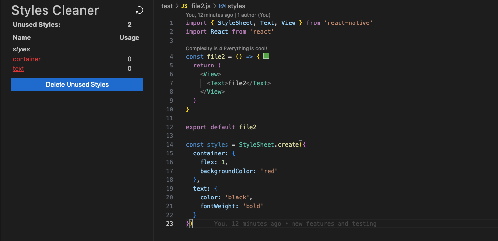
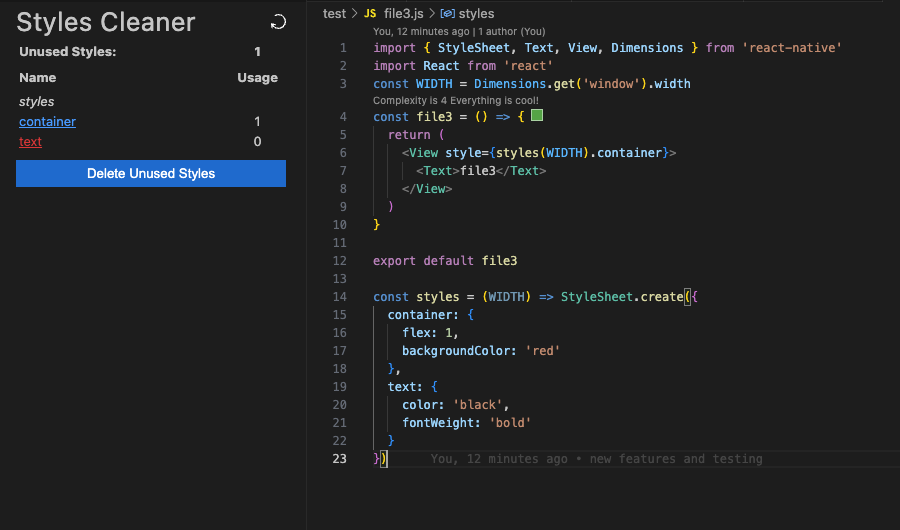
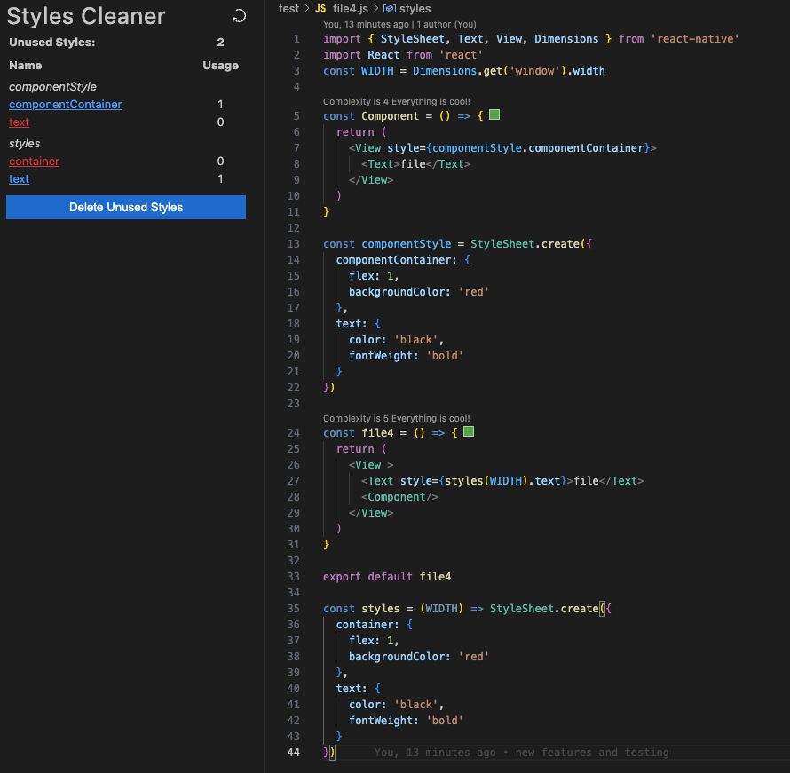

# VS Code Extension for Cleaning Unused Styles for React Native

**Features**
- Analyze styles in a React Native Project
- Remove all unused styles with a button press
- Extract all the styles defined in the file

**Sample**
 
*blue indicates a used style*
 
*red indicates an used style*
 
*each style can be clicked to quickly navigate to*
1. All Styles Unused

2. Mixture of used and unused styles

3. When multiple styles are defined in the file
